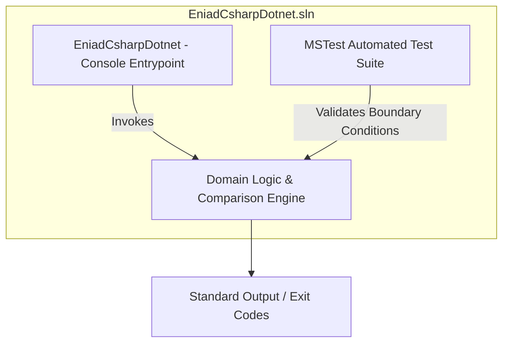

<div align="center">

<!-- Header Banner -->


<!-- Typing Animation -->
<p align="center">
  
</p>

<!-- Quality & Community Badges -->
<p align="center">
  <a href="LICENSE"></a>
  <a href="https://github.com/Bosaj/csharp-dotnet-enterprise-suite/actions"></a>
  <a href="https://github.com/Bosaj/csharp-dotnet-enterprise-suite"></a>
  <a href="https://github.com/users/Bosaj/projects"></a>
  <a href="https://github.com/stars/Bosaj/lists/eniad-academic-projects"></a>
  
  
  
</p>

</div>

<!-- Divider -->


## 📖 Overview

**C# .NET Enterprise Suite** is an academic software engineering and systems suite developed within the **State Engineering Degree in Artificial Intelligence & Digital Systems** at the **École Nationale d'Intelligence Artificielle et du Digital (ENIAD)**, Mohammed First University, Berkane, Morocco.

Developed for the **Développement d'Applications .NET** module (Semestre 7), this repository demonstrates enterprise .NET software engineering patterns, modular solution design, robust exception handling, and automated unit testing harnesses under modern .NET 9.

---

## 🏗️ Technical Architecture



---

## 🚀 Getting Started

### Prerequisites
- [.NET 9.0 SDK](https://dotnet.microsoft.com/download/dotnet/9.0) or compatible modern .NET runtime.

### Build & Run
```bash
# Clone the repository
git clone https://github.com/Bosaj/csharp-dotnet-enterprise-suite.git
cd csharp-dotnet-enterprise-suite

# Restore and build the solution
dotnet build EniadCsharpDotnet.sln

# Run the console entrypoint with default arguments (500 vs 600)
dotnet run --project CsharpProjects/EniadCsharpDotnet

# Run with custom integer parameters
dotnet run --project CsharpProjects/EniadCsharpDotnet -- 42 128
```

### Running Automated Tests
```bash
dotnet test tests/EniadCsharpDotnet.Tests/EniadCsharpDotnet.Tests.csproj --verbosity normal
```

---

## 📁 Repository Structure

```text
csharp-dotnet-enterprise-suite/
├── .devcontainer/
│   └── devcontainer.json
├── .github/
│   └── workflows/
│       └── ci.yml
├── assets/
│   └── social_preview.png
├── CsharpProjects/
│   └── EniadCsharpDotnet/
│       ├── Program.cs
│       └── EniadCsharpDotnet.csproj
├── docs/
│   └── wiki/
│       ├── Architecture-and-Design.md
│       ├── Developer-Guide.md
│       ├── Getting-Started.md
│       └── Home.md
├── tests/
│   └── EniadCsharpDotnet.Tests/
│       ├── ComparisonTests.cs
│       └── EniadCsharpDotnet.Tests.csproj
├── .editorconfig
├── CITATION.cff
├── CODE_OF_CONDUCT.md
├── CONTRIBUTING.md
├── Directory.Build.props
├── EniadCsharpDotnet.sln
├── LICENSE
├── README.md
└── SECURITY.md
```

---

## 📜 Academic Integrity & Citation

This repository is maintained as part of the official academic engineering portfolio of **Oussama EL HADJI** at **ENIAD Berkane**. If you reference this work, please see [`CITATION.cff`](CITATION.cff).

```bibtex
@misc{elhadji2026csharp,
  author = {EL HADJI, Oussama},
  title = {C# .NET Enterprise Architecture Suite},
  year = {2026},
  publisher = {GitHub},
  journal = {GitHub repository},
  howpublished = {\url{https://github.com/Bosaj/csharp-dotnet-enterprise-suite}}
}
```

---

## 🛡️ License & Security

- **License**: Released under the [MIT License](LICENSE).
- **Security Policy**: See [SECURITY.md](SECURITY.md) for vulnerability disclosure guidelines.
